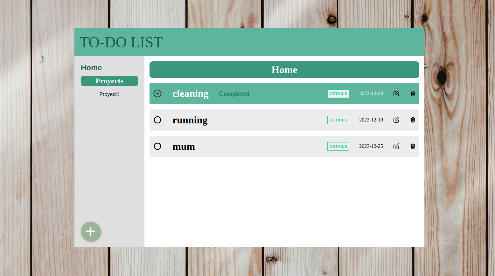

Project Description:
This project is a straightforward to-do list application that enables you to organize and keep track of your daily tasks. The user interface is intuitive and user-friendly, allowing you to efficiently add, mark as completed, and delete tasks.

Key Features:
Add Tasks: Easily add new tasks to your list.
Mark as Completed: Keep track of completed tasks with a simple click.
Delete Tasks: Remove tasks that are no longer needed.

